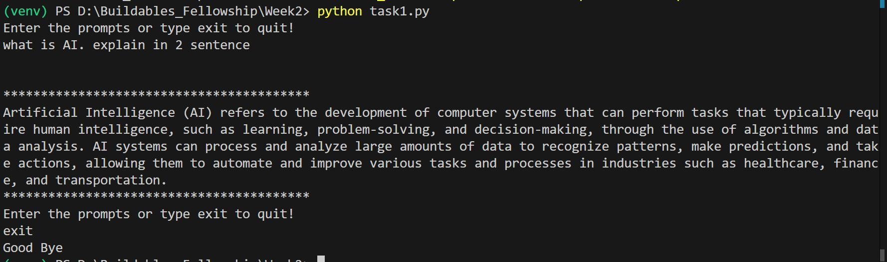
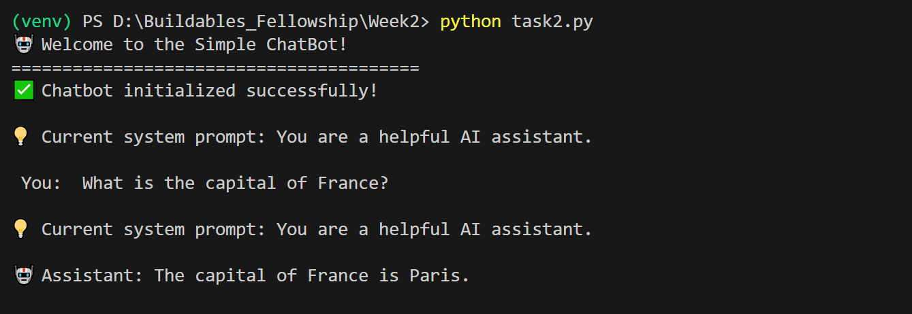
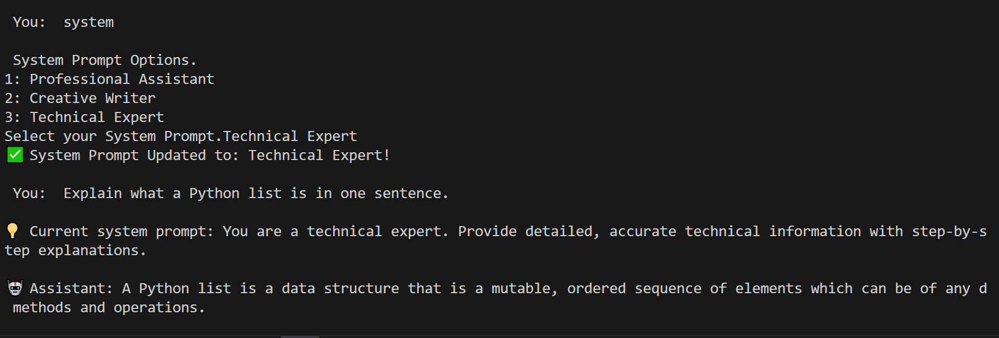
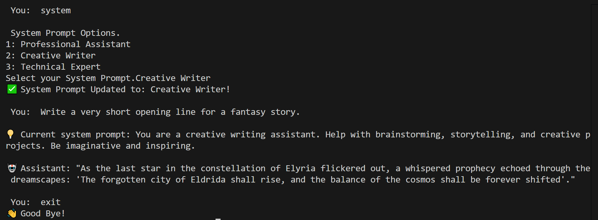

# 🤖 Conversational AI Chatbot (CLI + Web)

A conversational AI chatbot built with **Python, Groq API, and Streamlit**.  
This project demonstrates **LLM integration, prompt engineering, and conversational memory** across both **CLI** and **Web interfaces**.

---

## ✨ Features

- 🖥️ **Command-Line Chat (CLI)** – Simple terminal chatbot with conversation history  
- 🎭 **System Prompt Personalities** – Switch between roles:
  - Professional Assistant
  - Creative Writer
  - Technical Expert  
- 🌐 **Streamlit Web App** – Modern web interface with:
  - Chat history display  
  - System prompt selector  
  - Export chat to JSON  
  - Persistent conversation memory across sessions  
- 📊 **Prompt Engineering Experiments** – Compare how different system roles affect responses  

---

## 🚀 Tech Stack

- **Language**: Python 3.10+  
- **LLM Provider**: [Groq API](https://groq.com/) (LLaMA 3 8B model)  
- **Frameworks**: Streamlit (for UI)  
- **Environment**: Virtualenv + dotenv for API key management  

---

## 🛠️ Installation

Clone the repository and install dependencies:

```bash
git clone https://github.com/Arsalan-Azhar-AI/Buildables-Projects.git
cd week2

# Create & activate virtual environment
python -m venv venv
venv\Scripts\activate   # Windows
# source venv/bin/activate  # Mac/Linux

# Install dependencies
pip install -r requirements.txt
````

Set your **Groq API key** in a `.env` file:

```env
GROQ_API_KEY=your_api_key_here
```

---

## ▶️ Usage

### 1. Task 1 – Basic CLI Chat

```bash
python task1.py
```

* Type messages and receive responses
* Exit with `exit`

---

### 2. Task 2 – CLI with System Prompts

```bash
python task2.py
```

* Change AI persona with `system` command
* Exit with `exit`

---

### 3. Task 3 – Streamlit Web App

```bash
streamlit run task3.py
```

* Runs locally in your browser
* Switch between AI roles from sidebar
* Export chat history as JSON

---

## 📸 Screenshots

### Task 1 – Basic Chat



### Task 2 – Different System Prompts

#### Professional Assistant



#### Creative Writer



#### Technical Expert



---

## 🎥 Demo (Task 3 – Streamlit App)

👉 [Watch the full demo](https://drive.google.com/file/d/1fwIvEc53aF-1MIELC_-7L_zucOqk2Cw8/view?usp=sharing)

---

## 🧠 What I Learned

* How to use **chat completions API** with proper message formatting
* Importance of **system prompts** in shaping response tone & style
* Practical **prompt engineering techniques** (keywords, role instructions)
* Building a clean **Streamlit interface** with state management & export features
* How to persist **conversation memory** across sessions

---

## 🔮 Future Improvements

* Add support for **file uploads** (PDF, CSV, etc.)
* Multi-turn context with **longer memory**
* Richer **UI design** with avatars and chat bubbles
* Dockerize the app for deployment

---

## 👨‍💻 Author

Developed by **Arsalan Azgar** – aspiring AI Engineer.

